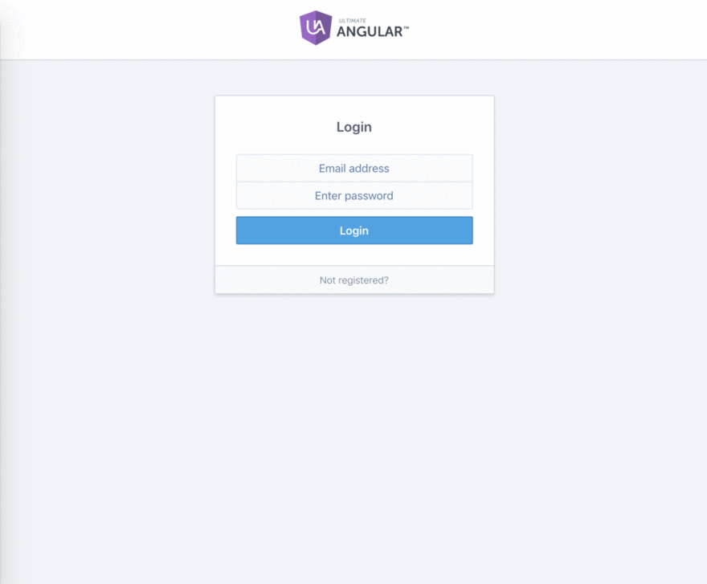

# Workout Fitness App
> An Angular 7 and Firebase application that monitors your health, schedule and meals. Learned and Inspired from Todd Motto



#### Back End Tools Used:
`Firebase`

#### Front End Tools used:
`Angular 7` `Angular CLI` `ES5` `RxJS`


#### How to run

```
$ npm install       - Installs frontend dependencies
$ npm start         - Runs your frontend application at http://localhost:4200
```
